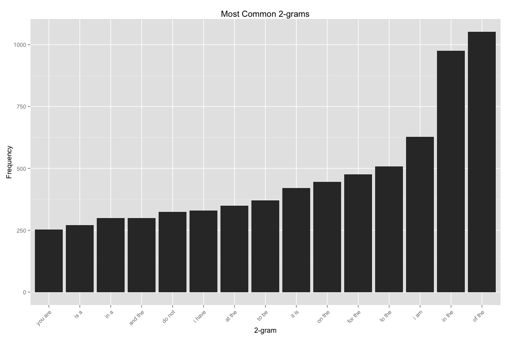
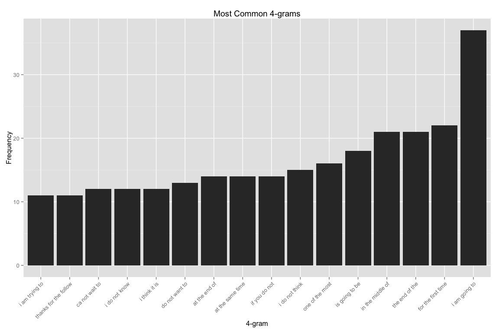

# Data Science Capstone Project
patrick charles  
`r Sys.Date()`  

## Text Prediction (Exploratory Analysis and Prediction)

## Summary

This document summarizes work done to construct, test and optimize a model for text prediction.

A body of sample texts consisting of ~4M documents including tweets, news articles and blog posts are loaded and exploratory analysis performed. Sets of n-grams are extracted from the body of text, predictive algorithms built, and various approaches for improving predictive accuracy refined. 

A cursory analysis of the dataset was presented in the [https://github.com/pchuck/coursera-ds-capstone/blob/master/milestone.md](Milestone 1) report.

This is the final capstone project for the Johns Hopkins data science specialization certification series. The corpus for the analysis is available at [Capstone Dataset](https://d396qusza40orc.cloudfront.net/dsscapstone/dataset/Coursera-SwiftKey.zip).


## Load and Examine the Sample Texts

### Documents


```
## [1] "en_US.blogs.txt"   "en_US.news.txt"    "en_US.twitter.txt"
```


The English-language content is used for the analysis. 3 document sets are ingested.

* __blogs__ contains 899288 lines, 37334690 words, and 210160014 characters.
* __twitter__ contains 2360148 lines, 30374206 words, and 167105338 characters.
* __news__ contains 1010242 lines, 34372720 words, and 205811889 characters.


## Exploratory Analysis

Document-term matrices are created and n-grams ranging in sequence length
from 1 to 5 words are created for the purpose of analyzing word frequencies
and various characteristics of the dataset.


### N-grams

n-grams are extracted to characterize the frequency of multi-word
clusters.


```r
  # sentence delimiters; prevent clustering across sentence boundaries
  delimiters <- " \\t\\r\\n.!?,;\"()"

  # n-gram tokenizers
  BigramTokenizer <- function(x) NGramTokenizer(x, Weka_control(min=2, max=2))
  TrigramTokenizer <- function(x, n) NGramTokenizer(x, Weka_control(min=3, max=3))
  QuadgramTokenizer <- function(x, n) NGramTokenizer(x, Weka_control(min=4, max=4))
  PentagramTokenizer <- function(x, n) NGramTokenizer(x, Weka_control(min=5, max=5))
 
  gthreshold <- 15 # threshold for number of n-grams to display graphically
  options(mc.cores=1) # limit cores to prevent rweka processing problems

  ft.1 <- 10
  dtm.1 <- DocumentTermMatrix(filtered.sub.np, control=list(minDocFreq=ft.1))  
  freq.1 <- sort(colSums(as.matrix(dtm.1)), decreasing=TRUE)
  nf.1 <- data.frame(word=names(freq.1), freq=freq.1)
  plotGram(gthreshold, freq.1, nf.1, "Word")
```

 

```r
  ft.2 <- 3
  dtm.2 <- DocumentTermMatrix(filtered.sub, control=list(tokenize=BigramTokenizer, bounds=list(global=c(ft.2, Inf))))
  freq.2 <- sort(col_sums(dtm.2, na.rm=T), decreasing=TRUE)
  nf.2 <- data.frame(word=names(freq.2), freq=freq.2)
  plotGram(gthreshold, freq.2, nf.2, "2-gram")
```

 

```r
  ft.3 <- 3
  dtm.3 <- DocumentTermMatrix(filtered.sub, control=list(tokenize=TrigramTokenizer, bounds=list(global=c(ft.3, Inf))))
  freq.3 <- sort(col_sums(dtm.3, na.rm=T), decreasing=TRUE)
  nf.3 <- data.frame(word=names(freq.3), freq=freq.3)
  plotGram(gthreshold, freq.3, nf.3, "3-gram")
```

 

```r
  ft.4 <- 2 
  dtm.4 <- DocumentTermMatrix(filtered.sub, control=list(tokenize=QuadgramTokenizer, bounds=list(global=c(ft.4, Inf))))
  freq.4 <- sort(col_sums(dtm.4, na.rm=T), decreasing=TRUE)
  nf.4 <- data.frame(word=names(freq.4), freq=freq.4)
  plotGram(gthreshold, freq.4, nf.4, "4-gram")
```

 

```r
  ft.5 <- 2
  dtm.5 <- DocumentTermMatrix(filtered.sub, control=list(tokenize=PentagramTokenizer, bounds=list(global=c(ft.5, Inf))))
  freq.5 <- sort(col_sums(dtm.5, na.rm=T), decreasing=TRUE)
  nf.5 <- data.frame(word=names(freq.5), freq=freq.5)
  plotGram(gthreshold, freq.5, nf.5, "5-gram")
```

 

### Final/Optimized Dataset


```r
  r <- 10 # frequency span for last-resort randomization
  nf <- list("f1"=nf.1, "f2"=nf.2, "f3"=nf.3, "f4"=nf.4, "f5"=nf.5, "r"=r)
  save(nf, file="data/nFreq.Rda") # save the ngram frequencies to disk
```

Generating the most common n-grams from even a subset (200K documents) of the
full corpus can take several hours. Here, it is saved in a previous
session and then loaded from disk:


```r
  load("data/nFreq-200000-10-3-3-2-2.Rda")
```

### N-Gram Distribution


```r
  # return the number of entries with frequency exceeding count
  countAboveFrequency <- function(nf, count) {
    dim(nf[nf$freq > count, ])[1]
  }
```

#### Total Count (Unique)
  * 5-grams: **370** (w/ frequency > 2)
  * 4-grams: **2090** (w/ frequency > 2)
  * 3-grams: **3523** (w/ frequency > 3)
  * 2-grams: **10708** (w/ frequency > 3)
  * words: **24859** (w/ frequency > 10)


#### Word Cloud

A word cloud can be used to show the most frequently occurring words and {2, 3, 4, 5}-grams.

 

## Prediction

### Unit Tests

Here are some simple tests to verify sane predictions for n-gram input phrases. The last word in each phrase is provided by the prediction function.

#### 5-grams
* was having a hard -> **time**

#### 4-grams
* thanks for the -> **follow**
* a few years -> **ago**
* the first time -> **in**
* i am so -> **excited**

#### 3-gram matches
* be a -> **good**
* can not -> **wait**
* no matter -> **how**

#### 2-gram matches
* a -> **lot**
* will -> **be**
* could -> **not**

#### non-match (***resorts to a pick from common 1-grams***)
* xxxxxxxx -> **are**


## Algorithm and Optimizations

### Algorithm

The following algorithm is applied for next word prediction

1. Capture input text, including all preceding words in the phrase
2. Iteratively traverse n-grams (longest to shortest) for matching strings
3. On match(s), use the longest, highest frequency occurring, n-gram
4. The last word in the matching n-gram is the predicted next word
5. If no matches found in n-grams, randomly select a common word from 1-grams

### Preprocessing

The following preprocessing steps were applied to create a set of
n-grams that  could be traversed in the search for a match with
the input phrase.

1. Convert texts to a DTM (document-term matrix)
    * full corpus (4.2M lines) stored as DTM is ~16GB
    * too large to manipulate in memory...
2. Reduce corpus size by sampling a 1/4 subset 
    * 1M documents can be stored and manipulated as a ~4GB DTM
3. Perform basic text filtering
    * remove digits
    * convert special characters (e.g. /'s, @'s and |'s) to whitespace
    * remove other special characters
    * convert to lower case
    * remove punctuation (for 1-grams), keep (for other n-grams)
    * remove excess whitespace
4. From the transformed/filtered DTM, generate n-grams
    * use {1, 2, 3, 4}-grams as a starting point

### Optimizations 

The algorithm depends on the existence of a set of n-grams which
is large enough to contain a good sampling of word combinations but
small enough to be searched in a fraction of a second. The following
optimizations were tested in the pursuit of finding a reasonable balance
between accuracy and prediction speed. For each combination, accuracy,
execution time and dataset size were recorded.

5. Initial attempt to generate {1, 2, 3, 4}-grams
    * Tokenization of 4GB DTM still too memory/compute intensive
    * Resulting sparse matrix X*Y dimensions too large
    * Work around RWeka errors with "options(mc.cores=1)"
6. Subsample DTM down further to 10K documents and generate {1, 2, 3, 4}-grams
    * **Result: 10.1% accuracy, 8ms response time, 9.4MB dataset**
7. Add 5-grams in attempt to improve accuracy
    * **Result: 8.4% accuracy, 285ms response time, 14.1MB dataset**
    * Worse accuracy? Maybe the corpus is too small..
8. Increase size of sampled corpus (from 10K to 50K docs) and drop n-grams which don't occur at least once to improve accuracy and reduce DTM size
    * **Result: 10.8% accuracy, 34ms response time, 1.0MB dataset**
    * Better accuracy, pruning the n-grams seems promising..
9. Further prune low-frequency n-grams (<10/6/4/3/2 occurrences)
    * **Result: 11.8% accuracy, 27ms response time, 0.7MB dataset**
10. Increase size of sampled corpus (from 50K to 100K docs)
    * **Result: 12.3% accuracy, 37ms response time, 1.2MB dataset**
11. Further increase size of sampled corpus (from 100K to 200K docs)
    * **Result: 15.3% accuracy, 395ms response time, 11.7MB dataset**
12. Apply profanity filter
    * **Result: 15.3% accuracy, 400ms response time, 11.6MB dataset**
13. Prune 2 and 3-grams occurring less than 3-times to improve performance
    * **Result: 15.2% accuracy, 257ms response time, 9.1MB dataset**

### Final, Optimized N-grams

* 4M corpus reduced to 1M documents via random sampling
* 1M documents cleaned/transformed and reduced to 200K subset
* Document-term matrix generated and n-grams up to depth 5 extracted
* n-grams organized by frequency/# of occurrences in corpus
* Least common n-grams pruned/dropped, resulting in final dataset
    * Optimized N-grams: **9.1MB** compressed, **104MB** in-memory
    * 18,936 words occurring more than 10x
    * 199,966 2-grams w/ frequency > 3x
    * 150,489 3-grams w/ frequency > 3x
    * 139,984 4-grams w/ frequency > 2x
    * 43,024 5-grams w/ frequency > 2x

## Conclusions

Through a series of iterations of exploratory analysis, refinements and
testing, predictive accuracy was improved from 8% to 15% while maintaining
a response time suitable for interactive use (<300ms) and producing
a compressed and optimized dataset under 10MB in size.

### Accuracy

As a final accuracy test, **1000** random phrases of
varying length were extracted from
the testing text set and the last word of each sequence excluded.
The word prediction model was then invoked on each test phrase and the
predicted word compared to the actual (excluded) word from the phrase.


The measured accuracy of the model (using only the 1st, top-ranked, response) is **14.19%**.
  

  The measured accuracy of the model (using top-5 ranked responses) is **21.63%**.

### Performance

The average speed of the algorithm is **238.0ms** per word prediction.

### Interactive Shiny Application and Further Details 

A web application was developed to allow users to interact
the prediction algorithm. The corpus preprocessing code and algorithms
are linked below.

* [text-predictor application](http://pchuck.shinyapps.io/text-predictor) 
* [github repository](http://github.com/pchuck/coursera-ds-capstone) 
* [rpubs final report](http://rpubs.com/pchuck/text-predictor) 
* [slidify presentation](http://rpubs.com/pchuck/text-predictor-slides)
