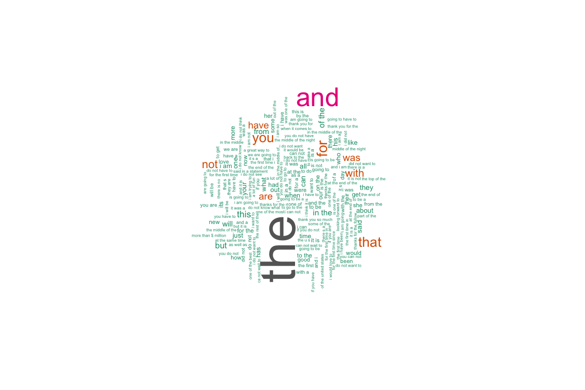
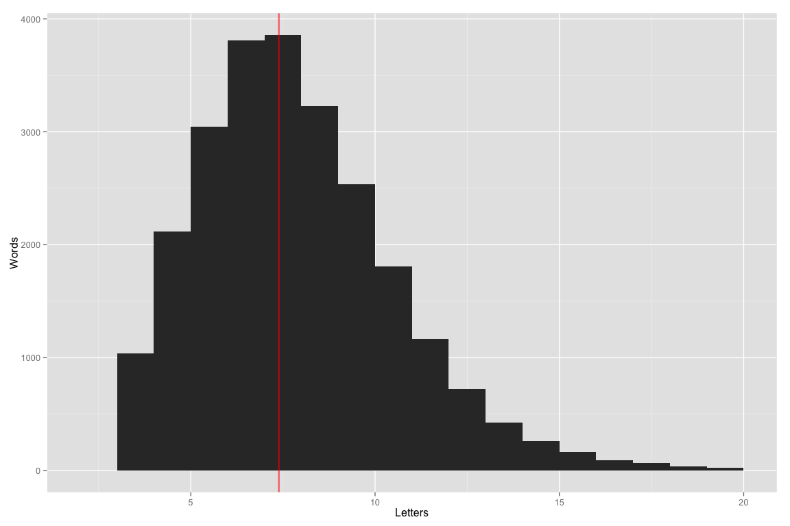
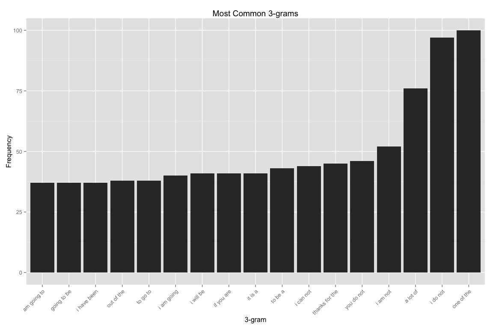

# Data Science Capstone Project
patrick charles  
`r Sys.Date()`  

## Text Prediction (Exploratory Analysis and Prediction)

## Summary

A model and algorithms for text prediction are constructed. This is the final capstone project for the Johns Hopkins data science specialization certification series. 

In this dynamic document, the body of sample texts is loaded, exploratory analysis performed and a model and algorithm for word prediction built.

The [Capstone Dataset](https://d396qusza40orc.cloudfront.net/dsscapstone/dataset/Coursera-SwiftKey.zip) sample texts include content captured from blogs, new sources and twitter.


## Load and Examine the Sample Texts

### Documents

The English-language content is used for the analysis.


```r
  # view the English sample text source documents
  cpath <- file.path(".", "data", "final", "en_US")
  csize <- length(dir(cpath))
  dir(cpath)
```

```
## [1] "en_US.blogs.txt"   "en_US.news.txt"    "en_US.twitter.txt"
```


There are 3 documents in the English text samples.

* __blogs__ contains 899288 lines, 37334690 words, and 210160014 characters.
* __twitter__ contains 2360148 lines, 30374206 words, and 167105338 characters.
* __news__ contains 1010242 lines, 34372720 words, and 205811889 characters.

### Load Full Corpus of Texts


### Subset into a Training and Testing Corpus


## Cleaning and Transformation

```r
  filtered <- createCleanCorpus(texts.training)
  filtered.test <- createCleanCorpus(texts.testing)

  filtered
```

```
## <<VCorpus (documents: 10000, metadata (corpus/indexed): 0/0)>>
```

```r
  filtered.test
```

```
## <<VCorpus (documents: 100, metadata (corpus/indexed): 0/0)>>
```


## Exploratory Analysis

A document-term matrix is created from the samples for the purpose of
analyzing word frequencies and characteristics.

### Most Frequently Occurring Terms


```r
  fthreshold <- 20 # frequency list entry threshold
  # minfreq <- 3 # too large. produces dim: 500000x229481 > 4503599627370496
  minfreq <- 10 # minimum required doc frequency for dtm
  dtm.1 <- DocumentTermMatrix(filtered, control=list(minDocFreq=minfreq))
  freq.1 <- sort(colSums(as.matrix(dtm.1)), decreasing=TRUE)
  wf.1 <- data.frame(word=names(freq.1), freq=freq.1)
  
  findFreqTerms(dtm.1, lowfreq=wf.1$freq[fthreshold])
```

```
##  [1] "about" "all"   "and"   "are"   "but"   "for"   "from"  "have" 
##  [9] "his"   "not"   "out"   "said"  "that"  "the"   "they"  "this" 
## [17] "was"   "will"  "with"  "you"
```

```r
  # plot frequencies
  ggplot(subset(wf.1, freq>wf.1$freq[fthreshold]),
    aes(reorder(word, freq), freq)) +
    geom_bar(stat="identity") + 
    theme(axis.text.x=element_text(angle=45, hjust=1)) +
    ggtitle("Most Common Words") + xlab("Word") + ylab("Frequency") 
```

 

### Least Frequently Occurring Terms


```r
  head(findFreqTerms(dtm.1, highfreq=1), 10)
```

```
##  [1] "aaaand"  "aaawww"  "aahha"   "aahsl"   "aam"     "aardman" "aarons" 
##  [8] "aarp"    "abab"    "aback"
```

### Wordcloud

The wordcloud is a graphical visualization of word occurrence where
size is scaled by frequency.


```r
  set.seed(482)
  wordcloud(names(freq.1), freq.1, min.freq=40, max.words=100,
    colors=brewer.pal(8, "Dark2"), rot.per=0.35, scale=c(5, 0.5))
```

 

### Word Length Frequency

A histogram of number of letters by word frequency illustrates
the distribution of word lengths and highlights the average word length.

 

The average length word in the sample texts has 7 characters.


### N-grams

n-grams are extracted to characterize the frequency of multi-word
clusters.


```r
  # sentence delimiters; prevent clustering across sentence boundaries
  delimiters <- " \\t\\r\\n.!?,;\"()"

  # n-gram tokenizers
  BigramTokenizer <-
    function(x) NGramTokenizer(x, Weka_control(min=2, max=2))
  TrigramTokenizer <-
    function(x, n) NGramTokenizer(x, Weka_control(min=3, max=3))
  QuadgramTokenizer <-
    function(x, n) NGramTokenizer(x, Weka_control(min=4, max=4))
  PentagramTokenizer <-
    function(x, n) NGramTokenizer(x, Weka_control(min=5, max=5))
 
  gthreshold <- 15 # threshold for number of gram matches to display
  options(mc.cores=1) # limit cores to prevent rweka processing problems
  
  dtm.2 <-
    DocumentTermMatrix(filtered, control=list(tokenize=BigramTokenizer))
  freq.2 <- sort(colSums(as.matrix(dtm.2)), decreasing=TRUE)
  wf.2 <- data.frame(word=names(freq.2), freq=freq.2)
  plotGram(gthreshold, freq.2, wf.2, "Bigram")
```

 

```r
  dtm.3 <-
    DocumentTermMatrix(filtered, control=list(tokenize=TrigramTokenizer))
  freq.3 <- sort(colSums(as.matrix(dtm.3)), decreasing=TRUE)
  wf.3 <- data.frame(word=names(freq.3), freq=freq.3)
  plotGram(gthreshold, freq.3, wf.3, "Trigram")
```

 

```r
  dtm.4 <-
    DocumentTermMatrix(filtered, control=list(tokenize=QuadgramTokenizer))
  freq.4 <- sort(colSums(as.matrix(dtm.4)), decreasing=TRUE)
  wf.4 <- data.frame(word=names(freq.4), freq=freq.4)
  plotGram(gthreshold, freq.4, wf.4, "Quadgram")
```

 

```r
  dtm.5 <-
    DocumentTermMatrix(filtered, control=list(tokenize=PentagramTokenizer))
  freq.5 <- sort(colSums(as.matrix(dtm.5)), decreasing=TRUE)
  wf.5 <- data.frame(word=names(freq.5), freq=freq.5)
  plotGram(gthreshold, freq.5, wf.5, "Quadgram")
```

 

### N-Gram Distribution


```r
  # return the number of entries with frequency exceeding count
  countAboveFrequency <- function(wf, count) {
    dim(wf[wf$freq > count, ])[1]
  }
```

#### Total Count (Unique)
  * pentagrams: **195297**
  * quadgrams: **201839**
  * trigrams: **194413**
  * bigrams: **132109**
  * words: **24475**

####  Occurring More Than Once
  * pentagrams: **439**
  * quadgrams: **2242**
  * trigrams: **9720**
  * bigrams: **21805**
  * words: **10727**

#### Occurring More Than Twice
  * pentagrams: **63**
  * quadgrams: **504**
  * trigrams: **3383**
  * bigrams: **10510**
  * words: **7270**


```r
  # prune the word frequencies, removing entries w/ frequency < count
  prune <- function(wf, count) {
    wf[wf$freq > count, ]
  }

  prune.threshold = 3

  wf.5.pruned <- prune(wf.5, prune.threshold)
  wf.4.pruned <- prune(wf.4, prune.threshold)
  wf.3.pruned <- prune(wf.3, prune.threshold)
  wf.2.pruned <- prune(wf.2, prune.threshold)
  wf.1.pruned <- prune(wf.1, prune.threshold)


#!!!
  # dtm.1 <- DocumentTermMatrix(filtered, control=list(bounds=list(global=c(10, Inf))))
```


## Prediction

### Prediction Functions/Algorithm


```r
  r <- 10 # frequency span for last-resort randomization
  nf <- list("f1"=wf.1, "f2"=wf.2, "f3"=wf.3, "f4"=wf.4, "f5"=wf.5, "r"=r)

  # this file is used by the text-prediction shiny application
  # as it encapsulates everything needed for textPrediction::predictNext()
#  save(nf, file="nFreq.Rda") # save the ngram frequencies to disk
  load("nFreq-50000-2-2-2-2-2.Rda")
```

### Prediction Tests (Unit Tests)


```r
  # 4-gram matches
  predictNext("could be a", nf)
```

```
## [1] "very"
```

```r
  predictNext("i have to say thanks for the", nf)
```

```
## [1] "follow"
```

```r
  predictNext("a few years", nf)
```

```
## [1] "ago"
```

```r
  predictNext("the first time", nf)
```

```
## [1] "i"
```

```r
  predictNext("i am so", nf)
```

```
## [1] "excited"
```

```r
  predictNext("ejefiei i am so", nf)
```

```
## [1] "excited"
```

```r
  # 3-gram matches
  predictNext("be a", nf)
```

```
## [1] "good"
```

```r
  predictNext("can not", nf)
```

```
## [1] "wait"
```

```r
  predictNext("no matter", nf)
```

```
## [1] "how"
```

```r
  predictNext("jefjieie no matter", nf)
```

```
## [1] "how"
```

```r
  # 2-gram matches
  predictNext("a", nf)
```

```
## [1] "lot"
```

```r
  predictNext("will", nf)
```

```
## [1] "be"
```

```r
  predictNext("could", nf)
```

```
## [1] "not"
```

```r
  predictNext("ejfejke could", nf)
```

```
## [1] "not"
```

```r
  # non-matches
  predictNext("jkefjiee", nf)
```

```
## [1] "have"
```

### Accuracy Tests

Random substrings are extracted from the testing text set.
The last word is excluded and the prediction model called on
the string. The actual last word is then compared with the predicted
last word, to guage the accuracy of the model.


```r
  # extract a random substring of the provided text
  #   text - a string of characters containing words
  #
  # returns both a substring and the actual next word, for prediction testing
  randomSubstring <- function(text) {
    # convert characters to a vector
    wv <- unlist(strsplit(text, " "))
    wv.start <- as.integer(runif(1, 1, length(wv) - 1))
    wv.length <- as.integer(runif(1, 1, length(wv) - wv.start + 1))
    wv.sub <- paste(wv[wv.start:(wv.start + wv.length - 1)], collapse=" ")
    wv.next <- paste(wv[(wv.start + wv.length):(wv.start + wv.length)], collapse=" ")

    list("sub"=wv.sub, "nxt"=wv.next)
  }

  success <- 0
  invalid <- 0
  for(i in 1:length(filtered.test)) {
    testText <- filtered.test[[i]]$content

    # exclude testing texts with only a single word (e.g. nothing to predict!)
    if(wordCount(testText) > 1) {
      ts <- randomSubstring(testText)
      if(predictNext(ts$sub, nf)[1] == ts$nxt) success = success + 1
    }
    else {
      invalid <- invalid + 1 # count of invalid tests
    }
  }

  accuracy <- success * 100 / (length(filtered.test) - invalid)
```

**100** strings were set aside in a test dataset.

**100** test strings were valid / testable.

Substrings were randomly selected from the test data and the model 
successfully predicted the actual last word of the substring
**9** of **100** times.

The measured accuracy of the model is **9%**.
  

## Next Steps

* apply same filters to input as output (lowercase, contractions)

* increase size of ngrams stored

* prune the ngrams, see !!! above

* optimize

* remove code from display


```r
#  tdm <-
#    TermDocumentMatrix(filtered, control=list(tokenize =
#      BigramTokenizer))
#  inspect(tdm)

  customPunctuation <- function (x, preserve_intra_word_dashes = FALSE) {
    rpunct <- function(x) {
      x <- gsub("'", "\002", x)
      x <- gsub("[[:punct:]]+", "", x)
      gsub("\002", "'", x, fixed = TRUE)
    }
    if(preserve_intra_word_dashes) {
      x <- gsub("(\\w)-(\\w)", "\\1\001\\2", x)
      x <- rpunct(x)
      gsub("\001", "-", x, fixed = TRUE)
    } else {
      rpunct(x)
    }
  }
#  filtered <- tm_map(filtered, customPunctuation, preserve_intra_word_dash=T)


  # emoticons (https://en.wikipedia.org/wiki/List_of_emoticons)
  emoticons <- c(":-)", ":)", ":D", ":o)", ":]",
  ":3", ":c)", ":>", "=]", "8)", "=)", ":}", ":^)", ":-D", "8-D", "8D", "x-D", "xD", "X-D", "XD", "=-D", "=D", "=-3",
  "=3", "B^D", ":-))", ">:[", ":-(", ":(", ":-c", ":c", ":-<", ":<", ":-[", ":[", ":{", ";(", ":-||", ":@", ">:(", ":'-(", ":'(", ":'-)", ":')", "D:<", "D:", "D8", "D;",
  "D=", "DX", "v.v", "D-':", ">:O", ":-O", ":O", ":-o", ":o", "8-0", "O_O", "o-o", "O_o", "o_O", "o_o", "O-O", ";D", ">:P", ":-P", ":P", "X-P", "x-p", "xp", "XP", ":-p", ":p", 
  "=p", ":-b", ":b", "d:", ":L", "=L", ":S", ":-X", ":X", ":-#", ":#", "O:-)", "0:-3", "0:3", "0:-)", "0:)", "0;^)", ":-J", "|-O", 
  "<3", "</3")

  # remove emoticons
#  filtered <- tm_map(filtered, removeWords, emoticons)
```
