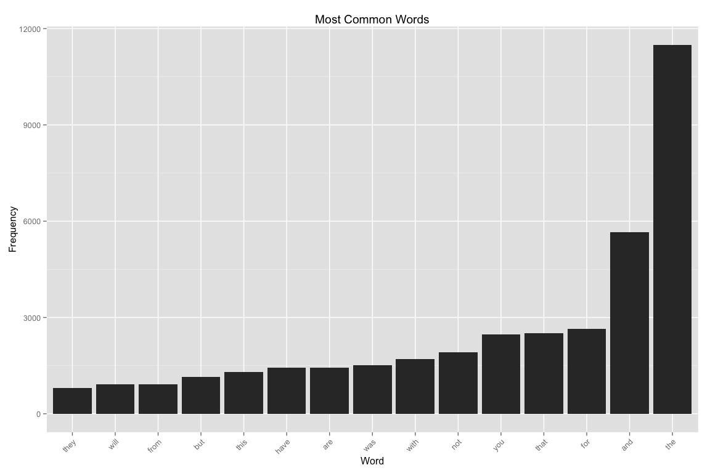

# Data Science Capstone Project
patrick charles  
`r Sys.Date()`  

## Text Prediction (Exploratory Analysis and Prediction)

## Summary

A model and algorithms for text prediction are constructed. This is the final capstone project for the Johns Hopkins data science specialization certification series. 

In this dynamic document, the body of sample texts is loaded, exploratory analysis performed and a model and algorithm for word prediction built.

The [Capstone Dataset](https://d396qusza40orc.cloudfront.net/dsscapstone/dataset/Coursera-SwiftKey.zip) sample texts include content captured from blogs, new sources and twitter.


## Load and Examine the Sample Texts

### Documents

The English-language content is used for the analysis.


```r
  # view the English sample text source documents
  cpath <- file.path(".", "data", "final", "en_US")
  csize <- length(dir(cpath))
  dir(cpath)
```

```
## [1] "en_US.blogs.txt"   "en_US.news.txt"    "en_US.twitter.txt"
```


There are 3 documents in the English text samples.

* __blogs__ contains 899288 lines, 37334690 words, and 210160014 characters.
* __twitter__ contains 2360148 lines, 30374206 words, and 167105338 characters.
* __news__ contains 1010242 lines, 34372720 words, and 205811889 characters.

### Load Full Corpus of Texts


### Subset into a Training and Testing Corpus


## Cleaning and Transformation

```r
  ## profanity, via http://fffff.at/googles-official-list-of-bad-words/
  profanity <- as.character(read.csv("profanity.txt", header=FALSE)$V1)
  # for unigrams, remove punctuation
  filtered.sub.np <- createCleanCorpus(texts.training,
    remove.punct=TRUE, remove.profanity=TRUE, profanity)
  # for generating predictive corpus, leave punctuation. tm/dtm uses.
  filtered.sub <- createCleanCorpus(texts.training,
    remove.punct=FALSE, remove.profanity=TRUE, profanity)
  # for generating test text, remove punctuation
  filtered.test <- createCleanCorpus(texts.testing, remove.punct=TRUE)

  filtered.sub
```

```
## <<VCorpus (documents: 10000, metadata (corpus/indexed): 0/0)>>
```

```r
  filtered.test
```

```
## <<VCorpus (documents: 100, metadata (corpus/indexed): 0/0)>>
```


## Exploratory Analysis

A document-term matrix is created from the samples for the purpose of
analyzing word frequencies and characteristics.

### Most Frequently Occurring Terms


```r
  fthreshold <- 20 # frequency list entry threshold
  # minfreq <- 3 # too large. produces dim: 500000x229481 > 4503599627370496
  minfreq <- 10 # minimum required doc frequency for dtm
  dtm.1 <- DocumentTermMatrix(filtered.sub.np, control=list(minDocFreq=minfreq))
  freq.1 <- sort(colSums(as.matrix(dtm.1)), decreasing=TRUE)
  nf.1 <- data.frame(word=names(freq.1), freq=freq.1)
  
  findFreqTerms(dtm.1, lowfreq=nf.1$freq[fthreshold])
```

```
##  [1] "about" "all"   "and"   "are"   "but"   "for"   "from"  "have" 
##  [9] "his"   "not"   "out"   "said"  "that"  "the"   "they"  "this" 
## [17] "was"   "will"  "with"  "you"
```

```r
  # plot frequencies
  ggplot(subset(nf.1, freq>nf.1$freq[fthreshold]),
    aes(reorder(word, freq), freq)) +
    geom_bar(stat="identity") + 
    theme(axis.text.x=element_text(angle=45, hjust=1)) +
    ggtitle("Most Common Words") + xlab("Word") + ylab("Frequency") 
```

 

### Least Frequently Occurring Terms


```r
  head(findFreqTerms(dtm.1, highfreq=1), 10)
```

```
##  [1] "-nilly"     "-pat"       "-up"        "-vixen"     "a-buzz"    
##  [6] "a-coming"   "a-gallon"   "a-hole"     "a-line"     "a-ma-zi-ng"
```

### Wordcloud

The wordcloud is a graphical visualization of word occurrence where
size is scaled by frequency.


```r
  set.seed(482)
  wordcloud(names(freq.1), freq.1, min.freq=40, max.words=100,
    colors=brewer.pal(8, "Dark2"), rot.per=0.35, scale=c(5, 0.5))
```

 

### Word Length Frequency

A histogram of number of letters by word frequency illustrates
the distribution of word lengths and highlights the average word length.

 

The average length word in the sample texts has 7 characters.


### N-grams

n-grams are extracted to characterize the frequency of multi-word
clusters.


```r
  # sentence delimiters; prevent clustering across sentence boundaries
  delimiters <- " \\t\\r\\n.!?,;\"()"

  # n-gram tokenizers
  BigramTokenizer <-
    function(x) NGramTokenizer(x, Weka_control(min=2, max=2))
  TrigramTokenizer <-
    function(x, n) NGramTokenizer(x, Weka_control(min=3, max=3))
  QuadgramTokenizer <-
    function(x, n) NGramTokenizer(x, Weka_control(min=4, max=4))
  PentagramTokenizer <-
    function(x, n) NGramTokenizer(x, Weka_control(min=5, max=5))
 
  gthreshold <- 15 # threshold for number of gram matches to display
  options(mc.cores=1) # limit cores to prevent rweka processing problems

  ft.2 <- 3
  dtm.2 <- DocumentTermMatrix(filtered.sub, control=list(tokenize=BigramTokenizer, bounds=list(global=c(ft.2, Inf))))
  freq.2 <- sort(col_sums(dtm.2, na.rm=T), decreasing=TRUE)
  nf.2 <- data.frame(word=names(freq.2), freq=freq.2)
  plotGram(gthreshold, freq.2, nf.2, "Bigram")
```

 

```r
  ft.3 <- 3
  dtm.3 <- DocumentTermMatrix(filtered.sub, control=list(tokenize=TrigramTokenizer, bounds=list(global=c(ft.3, Inf))))
  freq.3 <- sort(col_sums(dtm.3, na.rm=T), decreasing=TRUE)
  nf.3 <- data.frame(word=names(freq.3), freq=freq.3)
  plotGram(gthreshold, freq.3, nf.3, "Quadgram")
```

 

```r
  ft.4 <- 2 
  dtm.4 <- DocumentTermMatrix(filtered.sub, control=list(tokenize=QuadgramTokenizer, bounds=list(global=c(ft.4, Inf))))
  freq.4 <- sort(col_sums(dtm.4, na.rm=T), decreasing=TRUE)
  nf.4 <- data.frame(word=names(freq.4), freq=freq.4)
  plotGram(gthreshold, freq.4, nf.4, "Quadgram")
```

 

```r
  ft.5 <- 2
  dtm.5 <- DocumentTermMatrix(filtered.sub, control=list(tokenize=PentagramTokenizer, bounds=list(global=c(ft.5, Inf))))
  freq.5 <- sort(col_sums(dtm.5, na.rm=T), decreasing=TRUE)
  nf.5 <- data.frame(word=names(freq.5), freq=freq.5)
  plotGram(gthreshold, freq.5, nf.5, "Pentagram")
```

 


```r
#  r <- 10 # frequency span for last-resort randomization
#  nf <- list("f1"=nf.1, "f2"=nf.2, "f3"=nf.3, "f4"=nf.4, "f5"=nf.5, "r"=r)
#  save(nf, file="nFreq.Rda") # save the ngram frequencies to disk
  load("nFreq-200000-10-3-3-2-2.Rda")
```

### N-Gram Distribution


```r
  # return the number of entries with frequency exceeding count
  countAboveFrequency <- function(nf, count) {
    dim(nf[nf$freq > count, ])[1]
  }
```

#### Total Count (Unique)
  * pentagrams: **345**
  * quadgrams: **2064**
  * trigrams: **3387**
  * bigrams: **10421**
  * words: **24485**


## Prediction

### Prediction Tests (Unit Tests)


```r
  # 4-gram matches
  predictNextWord("could be a", nf)
```

```
## [1] "good"
```

```r
  predictNextWord("i have to say thanks for the", nf)
```

```
## [1] "follow"
```

```r
  predictNextWord("a few years", nf)
```

```
## [1] "ago"
```

```r
  predictNextWord("the first time", nf)
```

```
## [1] "in"
```

```r
  predictNextWord("i am so", nf)
```

```
## [1] "excited"
```

```r
  predictNextWord("ejefiei i am so", nf)
```

```
## [1] "excited"
```

```r
  # 3-gram matches
  predictNextWord("be a", nf)
```

```
## [1] "good"
```

```r
  predictNextWord("can not", nf)
```

```
## [1] "wait"
```

```r
  predictNextWord("no matter", nf)
```

```
## [1] "how"
```

```r
  predictNextWord("jefjieie no matter", nf)
```

```
## [1] "how"
```

```r
  # 2-gram matches
  predictNextWord("a", nf)
```

```
## [1] "lot"
```

```r
  predictNextWord("will", nf)
```

```
## [1] "be"
```

```r
  predictNextWord("could", nf)
```

```
## [1] "not"
```

```r
  predictNextWord("ejfejke could", nf)
```

```
## [1] "not"
```

```r
  # non-matches
  predictNextWord("jkefjiee", nf)
```

```
## [1] "and"
```

### Accuracy Tests

Random substrings are extracted from the testing text set.
The last word is excluded and the prediction model called on
the string. The actual last word is then compared with the predicted
last word, to guage the accuracy of the model.


```r
  test.result <- testTimeAccuracy(filtered.test, nf)
```

**100** strings were set aside in a test dataset.

Substrings were randomly selected from the test data and the model 
used to predict the last word of the substring.

The measured accuracy of the model is **7%**.

The average speed of the algorithm is **2.0857\times 10^{4}ms** per word prediction.


## Optimizations 

### Test Results - Accuracy, Response Time and Dataset Size

* 10K texts, quadgrams, all punct stripped
** 10.1%, 8ms - load("nFreq-10000-1-1-1-1.Rda") 9.4B
* 10K texts, introduced pentagrams
** 8.4%, 285ms - load("nFreq-10000-1-1-1-1-1.Rda") 14.1MB
* 50K texts, <2 rep n-grams dropped
** 10.8%, 34ms - load("nFreq-50000-2-2-2-2-2.Rda") 1.0MB
* 50K texts, <10/6/4/3/2 rep n-grams dropped
** 11.8%, 27ms - load("nFreq-50000-10-6-4-3-2.Rda") 0.7MB
* 100K texts
** 12.3%, 37ms - load("nFreq-100000-2-2-2-2-2.Rda") 1.2MB
* 200K texts, hyphens intact in 1-grams, punct intact in 2+ grams
** 15.3%, 395ms - load("nFreq-200000-10-2-2-2-2-new.Rda")  11.7 MB
* w/ profanity removed
** 15.3%, 395ms - load("nFreq-200000-10-2-2-2-2.Rda")  11.6 MB
* further optimization, <3 rep 3-grams dropped
** 15.5%, 353ms - load("nFreq-200000-10-2-3-2-2.Rda")  10.2 MB
* further optimization, <3 rep 2 and 3-grams dropped
** 15.2%, 287ms - load("nFreq-200000-10-3-3-2-2.Rda")  9.1 MB


>
> save(nf, file="nFreq-200000-10-2-2-2-2-new.Rda")
> dim(nf.1)
[1] 19050     2
> dim(nf.2)
[1] 340191      2
> dim(nf.3)
[1] 319739      2
> dim(nf.4)
[1] 135801      2
> dim(nf.5)
[1] 41407     2
>


10-3-3-2-2

> dim(nf$f1)
[1] 18936     2
> dim(nf$f2)
[1] 199966      2
> dim(nf$f3)
[1] 150489      2
> dim(nf$f4)
[1] 139984      2
> dim(nf$f5)
[1] 43024     2
>
>
