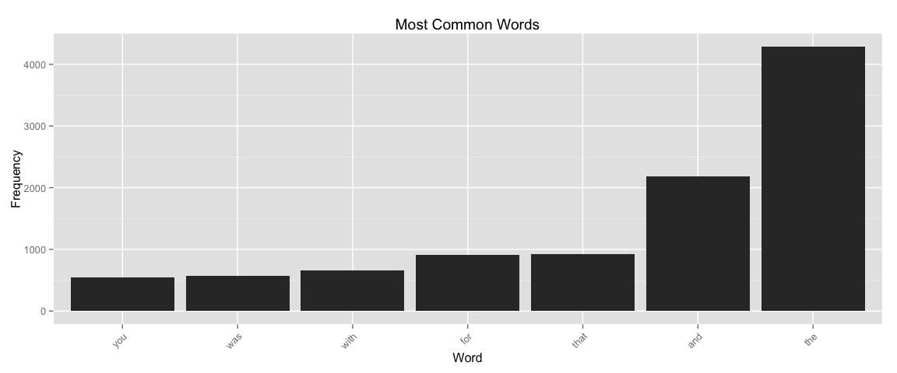
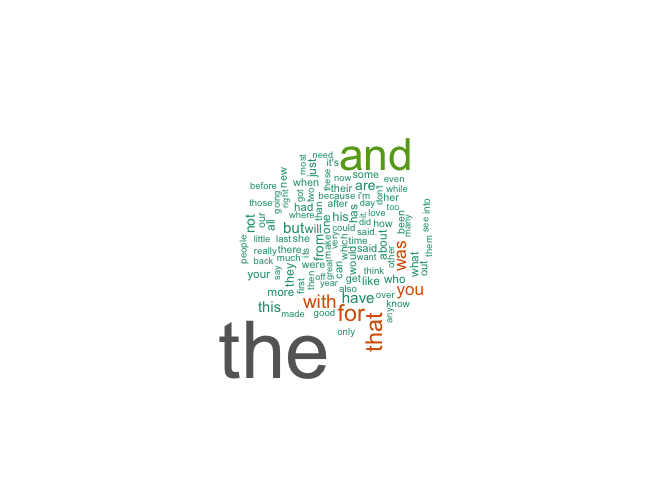
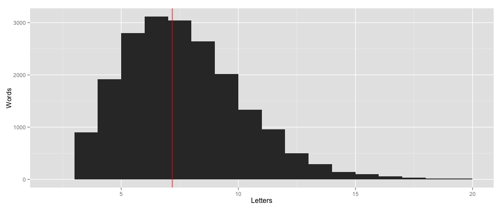

# Data Science Capstone Project, Milestone 1
patrick charles  
`r Sys.Date()`  

## Text Prediction (Intial Milestone Report)

## Summary

In this dynamic document, the body of sample text for the Johns Hopkins data science specialization word prediction capstone project is loaded, some basic cursory exploratory analysis performed and next steps recommended.

The [Capstone Dataset](https://d396qusza40orc.cloudfront.net/dsscapstone/dataset/Coursera-SwiftKey.zip) sample texts include content captured from blogs, new sources and twitter.


## Load and Examine the Sample Texts

### Documents

The English-language content is used for this preliminary analysis.


```r
  # view the English sample text source documents
  cpath <- file.path(".", "data", "final", "en_US")
  csize <- length(dir(cpath))
  dir(cpath)
```

```
## [1] "en_US.blogs.txt"   "en_US.news.txt"    "en_US.twitter.txt"
```


There are 3 documents in the English text samples.

* __blogs__ contains 899288 lines, 37334690 words, and 210160014 characters.
* __twitter__ contains 2360148 lines, 30374206 words, and 167105338 characters.
* __news__ contains 1010242 lines, 34372720 words, and 205811889 characters.


## Exploratory Analysis

A document-term matrix is created from the samples for the purpose of
analyzing word frequencies and characteristics.


```r
  dtm <- DocumentTermMatrix(corpus)
  freq <- colSums(as.matrix(dtm))
  count <- length(freq)
  ord <- order(freq)
```

### Most Frequently Occurring Terms


```r
  findFreqTerms(dtm, lowfreq=200)
```

```
##  [1] "about" "all"   "and"   "are"   "but"   "for"   "from"  "had"  
##  [9] "has"   "have"  "his"   "just"  "like"  "more"  "not"   "one"  
## [17] "out"   "that"  "the"   "they"  "this"  "was"   "what"  "who"  
## [25] "will"  "with"  "you"   "your"
```

 

### Least Frequently Occurring Terms


```r
  head(findFreqTerms(dtm, highfreq=1), 10)
```

```
##  [1] "-_____-"                                                                   
##  [2] "-____-"                                                                    
##  [3] "-___-"                                                                     
##  [4] "---"                                                                       
##  [5] "--a"                                                                       
##  [6] "--colton"                                                                  
##  [7] "--want"                                                                    
##  [8] "-.-"                                                                       
##  [9] "-http://deckboss.blogspot.ca/2012/05/legislature-lavishes-aquaculture.html"
## [10] "-mcm"
```

### Wordcloud

The wordcloud is a graphical visualization of word occurrence where
size is scaled by frequency.


```r
  set.seed(482)
  wordcloud(names(freq), freq, min.freq=40, max.words=100,
    colors=brewer.pal(8, "Dark2"), rot.per=0.35, scale=c(5, 0.5))
```

 

### Word Length Frequency

A histogram of number of letters by word frequency illustrates
the distribution of word lengths and highlights the average word length.

 

The average length word in the sample texts has 7 characters.


## Next Steps

* Data Cleaning: The least frequent word list reveals that the word sources are littered with separator characters, urls and other non-word sequences which should be filtered. Utilize the [tm](http://cran.r-project.org/web/packages/tm/index.html) text mining package.

* Build a model of word associations for the purpose of predictions, e.g. n-grams, based on the word sample texts and frequencies of multi-word chains. Utilize the [RWeka](http://cran.r-project.org/web/packages/RWeka/index.html) machine learning tools package.

* Optimize the model. The current dataset is very large with over __102 million words__. Performance constraints will likely require subsetting/narrowing the predictive search space.

* Build and deploy an interactive application using [Shiny](http://shinyapps.io) that allows a user to interact with the model by allowing the predictive algorithm to suggest words as the user types text.


